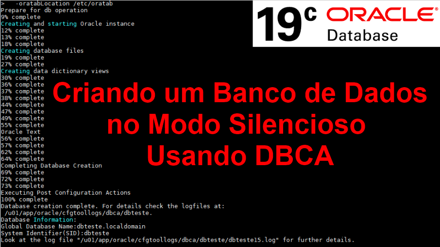
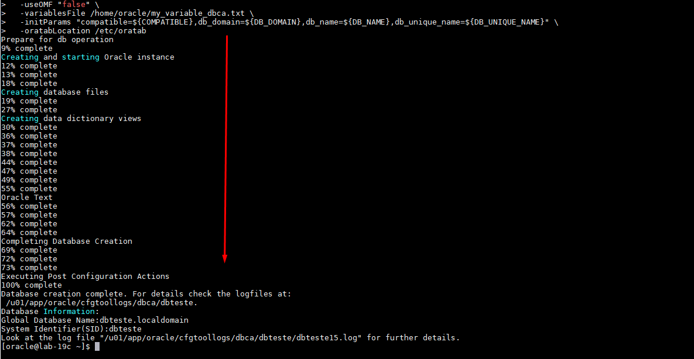
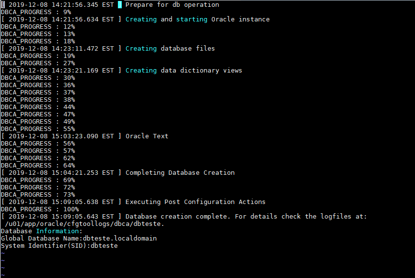

# Criando um Banco de Dados em Silent Mode no Oracle 19c Usando DBCA (DBA) 
##### Publicado em 08/12/2019 por [Michel Souza](https://www.linkedin.com/in/michel-ferreira-souza/)

<p style="text-align: justify">
Fala galera, neste post apresento como criar um banco de dados em modo silencioso usando DBCA a partir de template modelo, com intuito de multiplexar o controlfile, redolog e achivelog no momento da criação do banco.
</p>

> *"A melhor forma de aprender é ensinando ou compartilhando conhecimento"*

# Ambiente 
Para a criação do banco de dados, estou usando as configurações abaixo:
+ Sistema Operacional Oracle Linux 7
+ Banco de dados 19c

# DBCA (Database Configuration Assistant)
Uma das formas de criar um banco de dados Oracle é utilizando a interface gráfica DBCA. Neste post demonstro como criar um banco de dados em ```silent mode```, bem como a criação de um **template** modelo. <br>
No Oracle 19c existem 3 modelos para a criação de um banco de dados, conforme mostra a imagem abaixo. Nota-se que apenas dois modelos incluem datafiles(Yes), pelo fato de serem modelos do tipo SEED.<br>
 <br>
Nota-se a existência do template **My Custom Template** que foi criado para ser utilizado na criação do banco de dados **DBTESTE**. <br>
O Oracle disponibiliza dois tipos de templates SEED e NONSEED que ficam armazenados no diretório **$ORACLE_HOME/assistants/dbca/templates** no format XML. Segue abaixo a diferença de cada template: 
+ SEED: para esse modelo o arquivo tem a extensão **.dbc**, quando utilizamos esse modelo, tem-se o uso de um outro arquivo com a extensão **.dfb** que incluie os arquivos de banco de dados. A criação do banco de dados usando SEEDS é mais rápida, pelo fato que os arquivos físicos já foram criados e só serão copiados para o local de destino, logo o banco de dados já está criado.
+ NONSEED: nesse modelo o arquivo tem a extensão **.dbt**, e contém apenas as características do banco de dados a serem criadas, ou seja quando utilizado esse modelo é criado um novo banco de dados, bem como os arquivos de dados e executado alguns scripts. O uso desse modelo demanda um tempo para a criação do banco de dados.

Da mesma forma que é possível criar um banco de dados via interface gráfica e silent mode usando DBCA, é possível criar também um <a href="https://docs.oracle.com/cd/E17559_01/em.111/e16599/appdx_creating_db_templates.htm">template modelo</a>.

# Criando um template modelo
Uma das vantagens da criação de uma template é poder definir um único modelo e reutilizá-lo para futuras implantações, facilitando o compartilhamento. No dia a dia de um DBA tem-se demanda de criação de uma ambiente de teste, treinamento e produção. Pode-se criar um modelo especifico para cada ambiente e ainda setar os parâmetros de memória ou outros de forma dinâmica. <br>
Como informado anteriormente, criei um modelo my_custom_template.dbt e salvei no diretório **$ORACLE_HOME/assistants/dbca/templates**, a estrutura XML é apresentada abaixo. 

```xml
<DatabaseTemplate name="My Custom Template" description="" version="19.0.0.0.0">
   <CommonAttributes>
      <option name="OMS" value="false"/>
      <option name="JSERVER" value="false"/>
      <option name="SPATIAL" value="false"/>
      <option name="IMEDIA" value="false"/>
      <option name="ORACLE_TEXT" value="true">
         <tablespace id="SYSAUX"/>
      </option>
      <option name="SAMPLE_SCHEMA" value="false"/>
      <option name="CWMLITE" value="false">
         <tablespace id="SYSAUX"/>
      </option>
      <option name="APEX" value="false"/>
      <option name="DV" value="false"/>
   </CommonAttributes>
   <Variables/>
   <CustomScripts Execute="false"/>
   <InitParamAttributes>
      <InitParams>
		 <initParam name="db_name" value=""/>
		 <initParam name="processes" value="500"/>
		 <initParam name="sessions" value="772"/>
         <initParam name="dispatchers" value="(PROTOCOL=TCP) (SERVICE={SID}XDB)"/>
         <initParam name="audit_file_dest" value="{ORACLE_BASE}/admin/{DB_UNIQUE_NAME}/adump"/>
         <initParam name="compatible" value="19.0.0"/>
         <initParam name="remote_login_passwordfile" value="EXCLUSIVE"/>
         <initParam name="control_files" value="(&quot;{DEST_DATA}/control{DB_NAME}01.ctl&quot;, &quot;{DEST_REDO1}/control{DB_NAME}02.ctl&quot;, &quot;{DEST_REDO2}/control{DB_NAME}03.ctl&quot;)"/>
         <initParam name="diagnostic_dest" value="{ORACLE_BASE}"/>
         <initParam name="audit_trail" value="db,extended"/>
         <initParam name="db_block_size" value="8" unit="KB"/>
         <initParam name="open_cursors" value="500"/>
		 <initParam name="control_file_record_keep_time" value="20"/>
		 <initParam name="db_files" value="1000"/>
         <initParam name="db_flashback_retention_target" value="10080"/> 
		 <initParam name="db_recovery_file_dest_size" value="40G"/> 
		 <initParam name="db_recovery_file_dest" value="{DEST_FRA}"/> 
		 <initParam name="log_archive_dest_1" value="LOCATION={ARCH_DEST1} MANDATORY"/>
         <initParam name="log_archive_dest_state_1" value="ENABLE"/>
         <initParam name="log_archive_format" value="{DB_NAME}_%t_%r_%s.arc"/>
		 <initParam name="log_archive_dest_2" value="LOCATION={ARCH_DEST2} MANDATORY"/>
         <initParam name="log_archive_dest_state_2" value="ENABLE"/>
         <initParam name="log_archive_min_succeed_dest " value="2"/>
         <initParam name="nls_language" value="AMERICAN"/>
         <initParam name="nls_nchar_conv_excp" value="TRUE"/>
         <initParam name="nls_territory" value="AMERICA"/>
         <initParam name="undo_retention" value="1800"/>
		 <initParam name="undo_tablespace" value="UNDOTBS1"/>
      </InitParams>
      <MiscParams>
         <databaseType>MULTIPURPOSE</databaseType>
         <maxUserConn>20</maxUserConn>
         <percentageMemTOSGA>40</percentageMemTOSGA>
         <archiveLogMode>true</archiveLogMode>
         <initParamFileName>{ORACLE_BASE}/admin/{DB_NAME}/create/init{SID}.ora</initParamFileName>
      </MiscParams>
      <SPfile useSPFile="true">{ORACLE_BASE}/admin/{DB_NAME}/instance/spfile{SID}.ora</SPfile>
   </InitParamAttributes>
   <StorageAttributes>
      <ControlfileAttributes id="Controlfile">
         <maxDatafiles>100</maxDatafiles>
         <maxLogfiles>16</maxLogfiles>
         <maxLogMembers>5</maxLogMembers>
         <maxLogHistory>1</maxLogHistory>
         <maxInstances>8</maxInstances>
         <image name="control{DB_NAME}01.ctl" filepath="{DEST_DATA}/"/>
         <image name="control{DEST_REDO1}02.ctl" filepath="{DEST_REDO1}/"/>
         <image name="control{DEST_REDO2}03.ctl" filepath="{DEST_REDO2}/"/>
      </ControlfileAttributes>
      <DatafileAttributes id="{DEST_DATA}/sysaux01.dbf">
         <tablespace>SYSAUX</tablespace>
         <temporary>false</temporary>
         <online>true</online>
         <status>0</status>
         <size unit="MB">256</size>
         <reuse>true</reuse>
         <autoExtend>true</autoExtend>
         <increment unit="KB">8192</increment>
         <maxSize unit="MB">4096</maxSize>
      </DatafileAttributes>
      <DatafileAttributes id="{DEST_DATA}/teste_data01.dbf">
         <tablespace>TBS_TESTE</tablespace>
         <temporary>false</temporary>
         <online>true</online>
         <status>0</status>
         <size unit="MB">512</size>
         <reuse>true</reuse>
         <autoExtend>true</autoExtend>
         <increment unit="KB">4096</increment>
         <maxSize unit="MB">2048</maxSize>
      </DatafileAttributes>
	  <DatafileAttributes id="{DEST_DATA}/teste_data02.dbf">
         <tablespace>TBS_TESTE</tablespace>
         <temporary>false</temporary>
         <online>true</online>
         <status>0</status>
         <size unit="MB">512</size>
         <reuse>true</reuse>
         <autoExtend>true</autoExtend>
         <increment unit="KB">4096</increment>
         <maxSize unit="MB">2048</maxSize>
      </DatafileAttributes>
      <DatafileAttributes id="{DEST_DATA}/system01.dbf">
         <tablespace>SYSTEM</tablespace>
         <temporary>false</temporary>
         <online>true</online>
         <status>0</status>
         <size unit="MB">1024</size>
         <reuse>true</reuse>
         <autoExtend>true</autoExtend>
         <increment unit="KB">8192</increment>
         <maxSize unit="MB">4096</maxSize>
      </DatafileAttributes>
      <DatafileAttributes id="{DEST_DATA}/temp01.dbf">
         <tablespace>TEMPTBS</tablespace>
         <temporary>false</temporary>
         <online>true</online>
         <status>0</status>
         <size unit="MB">128</size>
         <reuse>true</reuse>
         <autoExtend>true</autoExtend>
         <increment unit="KB">2048</increment>
         <maxSize unit="MB">8192</maxSize>
      </DatafileAttributes>
      <DatafileAttributes id="{DEST_DATA}/undotbs1.dbf">
         <tablespace>UNDOTBS1</tablespace>
         <temporary>false</temporary>
         <online>true</online>
         <status>0</status>
         <size unit="MB">512</size>
         <reuse>true</reuse>
         <autoExtend>true</autoExtend>
         <increment unit="KB">2028</increment>
         <maxSize unit="MB">8192</maxSize>
      </DatafileAttributes>
      <TablespaceAttributes id="SYSAUX">
         <online>true</online>
         <offlineMode>1</offlineMode>
         <readOnly>false</readOnly>
         <temporary>false</temporary>
         <defaultTemp>false</defaultTemp>
         <undo>false</undo>
         <local>true</local>
         <blockSize>-1</blockSize>
         <allocation>1</allocation>
         <uniAllocSize unit="KB">-1</uniAllocSize>
         <initSize unit="KB">64</initSize>
         <increment unit="KB">64</increment>
         <incrementPercent>50</incrementPercent>
         <minExtends>1</minExtends>
         <maxExtends>4096</maxExtends>
         <minExtendsSize unit="KB">64</minExtendsSize>
         <logging>true</logging>
         <recoverable>false</recoverable>
         <maxFreeSpace>0</maxFreeSpace>
         <bigfile>false</bigfile>
         <datafilesList>
            <TablespaceDatafileAttributes id="{DEST_DATA}/sysaux01.dbf"/>
         </datafilesList>
      </TablespaceAttributes>
      <TablespaceAttributes id="TBS_TESTE">
         <online>true</online>
         <offlineMode>1</offlineMode>
         <readOnly>false</readOnly>
         <temporary>false</temporary>
         <defaultTemp>false</defaultTemp>
         <undo>false</undo>
         <local>true</local>
         <blockSize>-1</blockSize>
         <allocation>1</allocation>
         <uniAllocSize unit="KB">-1</uniAllocSize>
         <initSize unit="KB">128</initSize>
         <increment unit="KB">128</increment>
         <incrementPercent>0</incrementPercent>
         <minExtends>1</minExtends>
         <maxExtends>4096</maxExtends>
         <minExtendsSize unit="KB">128</minExtendsSize>
         <logging>true</logging>
         <recoverable>false</recoverable>
         <maxFreeSpace>0</maxFreeSpace>
         <bigfile>true</bigfile>
         <datafilesList>
            <TablespaceDatafileAttributes id="{DEST_DATA}/teste_data01.dbf"/>
			<TablespaceDatafileAttributes id="{DEST_DATA}/teste_data02.dbf"/>
         </datafilesList>
      </TablespaceAttributes>
      <TablespaceAttributes id="SYSTEM">
         <online>true</online>
         <offlineMode>1</offlineMode>
         <readOnly>false</readOnly>
         <temporary>false</temporary>
         <defaultTemp>false</defaultTemp>
         <undo>false</undo>
         <local>true</local>
         <blockSize>-1</blockSize>
         <allocation>3</allocation>
         <uniAllocSize unit="KB">-1</uniAllocSize>
         <initSize unit="KB">64</initSize>
         <increment unit="KB">64</increment>
         <incrementPercent>50</incrementPercent>
         <minExtends>1</minExtends>
         <maxExtends>-1</maxExtends>
         <minExtendsSize unit="KB">64</minExtendsSize>
         <logging>true</logging>
         <recoverable>false</recoverable>
         <maxFreeSpace>0</maxFreeSpace>
         <bigfile>false</bigfile>
         <datafilesList>
            <TablespaceDatafileAttributes id="{DEST_DATA}/system01.dbf"/>
         </datafilesList>
      </TablespaceAttributes>
      <TablespaceAttributes id="TEMPTBS">
         <online>true</online>
         <offlineMode>1</offlineMode>
         <readOnly>false</readOnly>
         <temporary>true</temporary>
         <defaultTemp>true</defaultTemp>
         <undo>false</undo>
         <local>true</local>
         <blockSize>-1</blockSize>
         <allocation>1</allocation>
         <uniAllocSize unit="KB">1012</uniAllocSize>
         <initSize unit="KB">64</initSize>
         <increment unit="KB">64</increment>
         <incrementPercent>0</incrementPercent>
         <minExtends>1</minExtends>
         <maxExtends>0</maxExtends>
         <minExtendsSize unit="KB">64</minExtendsSize>
         <logging>true</logging>
         <recoverable>false</recoverable>
         <maxFreeSpace>0</maxFreeSpace>
         <bigfile>false</bigfile>
         <datafilesList>
            <TablespaceDatafileAttributes id="{DEST_DATA}/temp01.dbf"/>
         </datafilesList>
      </TablespaceAttributes>
      <TablespaceAttributes id="UNDOTBS1">
         <online>true</online>
         <offlineMode>1</offlineMode>
         <readOnly>false</readOnly>
         <temporary>false</temporary>
         <defaultTemp>false</defaultTemp>
         <undo>true</undo>
         <local>true</local>
         <blockSize>-1</blockSize>
         <allocation>1</allocation>
         <uniAllocSize unit="KB">-1</uniAllocSize>
         <initSize unit="KB">512</initSize>
         <increment unit="KB">512</increment>
         <incrementPercent>50</incrementPercent>
         <minExtends>8</minExtends>
         <maxExtends>4096</maxExtends>
         <minExtendsSize unit="KB">512</minExtendsSize>
         <logging>true</logging>
         <recoverable>false</recoverable>
         <maxFreeSpace>0</maxFreeSpace>
         <bigfile>false</bigfile>
         <datafilesList>
            <TablespaceDatafileAttributes id="{DEST_DATA}/undotbs1.dbf"/>
         </datafilesList>
      </TablespaceAttributes>
      <RedoLogGroupAttributes id="1">
         <reuse>false</reuse>
         <fileSize unit="KB">153600</fileSize>
         <Thread>1</Thread>
         <member ordinal="0" memberName="redo01a.rdo" filepath="{DEST_REDO1}/"/>
         <member ordinal="1" memberName="redo01b.rdo" filepath="{DEST_REDO2}/"/>
      </RedoLogGroupAttributes>
      <RedoLogGroupAttributes id="2">
         <reuse>false</reuse>
         <fileSize unit="KB">153600</fileSize>
         <Thread>1</Thread>
         <member ordinal="0" memberName="redo02a.rdo" filepath="{DEST_REDO1}/"/>
         <member ordinal="1" memberName="redo02b.rdo" filepath="{DEST_REDO2}/"/>
      </RedoLogGroupAttributes>
      <RedoLogGroupAttributes id="3">
         <reuse>false</reuse>
         <fileSize unit="KB">153600</fileSize>
         <Thread>1</Thread>
         <member ordinal="0" memberName="redo03a.rdo" filepath="{DEST_REDO1}/"/>
         <member ordinal="1" memberName="redo03b.rdo" filepath="{DEST_REDO2}/"/>
      </RedoLogGroupAttributes>
	  <RedoLogGroupAttributes id="4">
         <reuse>false</reuse>
         <fileSize unit="KB">153600</fileSize>
         <Thread>1</Thread>
         <member ordinal="0" memberName="redo04a.rdo" filepath="{DEST_REDO1}/"/>
         <member ordinal="1" memberName="redo04b.rdo" filepath="{DEST_REDO2}/"/>
      </RedoLogGroupAttributes>
      <RedoLogGroupAttributes id="5">
         <reuse>false</reuse>
         <fileSize unit="KB">153600</fileSize>
         <Thread>1</Thread>
         <member ordinal="0" memberName="redo05a.rdo" filepath="{DEST_REDO1}/"/>
         <member ordinal="1" memberName="redo05b.rdo" filepath="{DEST_REDO2}/"/>
      </RedoLogGroupAttributes>
   </StorageAttributes>
</DatabaseTemplate>
```
Observa-se que com a criação do modelo **my_custom_template.dbt**, o banco de dados será criado com os seguintes requisitos:                      
+ Multiplexação de archivelog
+ Multiplexação do controlfile
+ Multiplexação do redolog
+ Criação de uma tablespace TBS_TESTE com dois datafiles
+ Modo Archivelog Habilitado
+ Setando parâmetros com valores já definidos, como exemplo o parâmetro control_file_record_keep_time e entre outros. 
+ Criando Tablespace com FORCE LOGGING 

# Definindo variáveis para entrada DBCA 
<p style="text-align: justify">   
Antes de executar o comando para a criação do banco de dados é necessário criar as variáveis que serão utilizadas como entrada para o DBCA, ou seja, percebe-se que a estrutura XML tem-se as seguintes variáveis abaixo: 
</p>

+ DB_NAME
+ ORACLE_BASE
+ DEST_FRA
+ SID
+ ARCH_DEST1
+ ARCH_DEST2
+ DEST_REDO1
+ DEST_REDO2
+ DEST_DATA

Crie as variáveis globais e locais abaixo no shell para serem utilizadas no template criado. 
```bash
export ORACLE_BASE=/u01/app/oracle
export ORACLE_HOME=${ORACLE_BASE}/product/19.3.0/dbhome_1
export PATH=${ORACLE_HOME}/bin:${PATH}

ORACLE_SID=dbteste
DB_NAME=dbteste
DB_UNIQUE_NAME=${DB_NAME}
DB_DOMAIN=localdomain
GLOBAL_DBNAME=${DB_NAME}.${DB_DOMAIN}
CHARSET=AL32UTF8
NATIONALCHARACTERSET=AL16UTF16
SYS_PWD=Manager19cTST
SYSTEM_PWD=Manager19cTST
REDO_SIZE_MB=100
COMPATIBLE=19.0.0
```

Crie um arquivo com o nome e destino em **/home/oracle/my_variable_dbca.txt** e execute no shell os comando abaixo. Nota-se que o DB_NAME será alimentado com o valor da variável criada no passo anterior. 
> **Observação**: Monte a estrutura conforme sua necessidade. 
```bash
echo "DEST_FRA=/u02/backup/fra/${DB_NAME}/" >   /home/oracle/my_variable_dbca.txt
echo "DEST_DATA=/u02/oradata/${DB_NAME}/"   >>  /home/oracle/my_variable_dbca.txt
echo "DEST_REDO1=/u02/oradata/${DB_NAME}/"  >>  /home/oracle/my_variable_dbca.txt
echo "DEST_REDO2=/u01/oradata/${DB_NAME}/"  >>  /home/oracle/my_variable_dbca.txt
echo "ARCH_DEST1=/u02/archive/${DB_NAME}/"  >>  /home/oracle/my_variable_dbca.txt
echo "ARCH_DEST2=/u01/archive/${DB_NAME}/"  >>  /home/oracle/my_variable_dbca.txt
```

# Criando o banco de dados em silent mode
Depois de realizar a criação do template e as variáveis, execute o comando abaixo no ```shell``` para criar o banco de dados DBTESTE.
> **Observação:** é possível utilizar o argumento responseFile passando um arquivo com os parâmentros necessários para a criação do banco de dados. Veja um exemplo [aqui](https://oracle-base.com/articles/misc/database-configuration-assistant-dbca-silent-mode). 
No comando abaixo, percebe-se a utilização de alguns parâmentros para a criação do banco de dados, irei detalhar alguns, mas caso queira conhecer outros parâmetros recomendo que leia [documentação](https://docs.oracle.com/en/database/oracle/oracle-database/19/admin/creating-and-configuring-an-oracle-database.html#GUID-0A94814D-032B-4F6A-8B54-A35223A1E3EF).
+ silent - responsável por intruir o assintente de configuração do banco de dados para executar no modo silencioso
+ createDatabase - informa o DBCA para criar um novo banco de dados
+ sid - nome da instância do banco de dados
+ gdbname - informa o nome glocal do banco de dados
+ characterSet - conjunto de caracteres que o banco de dados estará utilizando
+ emConfiguration - informa se o banco de dados será configurado para utilizar Enterprise Manager ou não.
+ templateName - informa qual template modelo deve usar para criar o banco de dados
+ **totalMemory - caso utilize esse parâmetro, o valor informado irá seguir a seguinte regra, nesse post setamos com valor de 2048MB => Desse valor 75% vai para SGA e 25% PGA**. 
+ redoLogFileSize - informa o tamanho do redolog na criação do banco de dados, caso não informe o padrão é 50MB. <br>
Comando para criar o banco de dados.
```bash
${ORACLE_HOME}/bin/dbca -silent -createDatabase      \
  -templateName "my_custom_template.dbt"             \
  -gdbName "${GLOBAL_DBNAME}"                        \
  -characterSet "${CHARSET}"                         \
  -createAsContainerDatabase "false"                 \
  -databaseConfigType SINGLE                         \
  -databaseType MULTIPURPOSE                         \
  -automaticMemoryManagement "false"                 \
  -totalMemory 2048                                  \
  -emConfiguration "NONE"                            \
  -nationalCharacterSet ${NATIONALCHARACTERSET}      \
  -redoLogFileSize "${REDO_SIZE_MB}"                 \
  -sampleSchema "false"                              \
  -sid "${ORACLE_SID}"                               \
  -sysPassword "${SYS_PWD}"                          \
  -systemPassword "${SYSTEM_PWD}"                    \
  -useOMF "false"                                    \
  -variablesFile /home/oracle/my_variable_dbca.txt   \
  -initParams "compatible=${COMPATIBLE},db_domain=${DB_DOMAIN},db_name=${DB_NAME},db_unique_name=${DB_UNIQUE_NAME}" \
  -oratabLocation /etc/oratab
```
Depois de executar o comando, tem-se a saída do log, conforme imagem abaixo. 


Analisando o log gerado, nota-se que a criação do banco de dados levou 50 minutos, pelo fato que utilizou-se o modelo NONSEED para a criação do banco. 


A imagem abaixo apresenta o banco de dados DBTESTE criado e em modo READ WRITE, archivelog habilitado, controlfile e redolog multiplexado. 


# Deletando um banco de dados em silent mode
Para deletar um banco de dados em modo silencioso é necessário informar a senha do SYS e o nome da instância, conforme o comando abaixo.
```bash
dbca -silent -deleteDatabase -sourceDB dbteste -sysDBAUserName sys -sysDBAPassword Manager19cTST
```

E isso é tudo, espero que esse artigo ajude em algum momento. 

Até o próximo artigo e vamos em frente!!!

#FocoForçaFé

[Michel Souza](https://www.linkedin.com/in/michel-ferreira-souza/)

 ### Referências
[Creating Templates for Oracle Database](https://docs.oracle.com/cd/E16447_01/doc/em.102/e14500/appdx_creating_db_templates.htm)