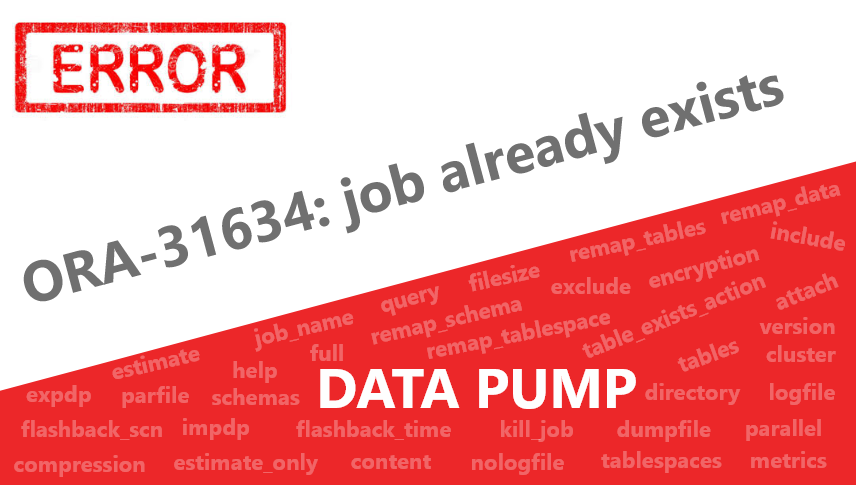
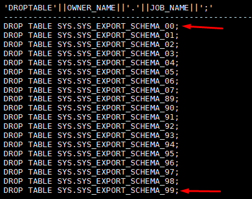

# Resolvendo ORA-31634 e ORA-31664 (DBA)
##### Publicado em 02/12/2019 por [Michel Souza](https://www.linkedin.com/in/michel-ferreira-souza/)

<p style="text-align: justify">
Fala galera, essa semana ao analisar os logs de backup lógico me deparei com o erro ORA-31634 e ORA-31664 no meu ambiente de estudo. Identifiquei que o erro estava ocorrendo há 38 dias, por ser apenas um ambiente de teste, o mesmo não era monitorado. Neste post apresento como resolvi esse tipo de problema.
</p>

> *"A melhor forma de aprender é ensinando ou compartilhando conhecimento"*

``` 
-- Erro encontrado nos logs.
ORA-31634: job already exists  
ORA-31664: unable to construct unique job name when defaulted
```
### E o ambiente que você gerência ?
 + Ele é monitorado ?<br>
 + Quais os tipos de backup's você sustenta no ambiente ? (Físico, Archivelog e Lógico)<br>
 + De quanto em quanto tempo é executado o backup de archivelog ?<br>
 + Verificou se os backup's estão sendo executados com sucesso ?<br>
 + Existe uma rotina de validação dos backup's físico para garantir a restauração dos mesmos em caso de falha? **É UM BACKUP VÁLIDO ?**

# Causa
<p style="text-align: justify">
Ao utilizar o DataPump para importar/exportar dados sem o uso do parâmetro <font style='font-weight:bold;'>JOB_NAME</font>, o Oracle DataPump gera um nome padrão (job name) exclusivo para o processo.  <br>
Existe um limite definido pelo Oracle DataPump, se por algum motivo o JOB_NAME já existe ou se você estiver executando muitas jobs ao mesmo tempo e o DataPump não puder criar um nome único, recebemos o erro ORA-31634 e ORA-31664. O erro ocorre, pelo fato que o DataPump cria apenas 99 job name distintos. <br>
Omitindo o parâmetro job_name, o DataPump gera um nome padrão no formato <i>SYS_EXPORT_&lt;mode&gt;_NN</i>, onde NN corresponde a um número inteiro entre 00 a 99. <br> 
</p>

Os modos "&lt;mode&gt;" de importação/exportação são listados abaixo:

    + Full
    + Schema
    + Table
    + Tablespace 
    + Transportable Tablespace
<p style="text-align: justify">
Outro motivo que faz com que o JOB_NAME fique gravado é quando o processo de datapump é interrompindo, como por exemplo, realizar um KILL do processo que está execuntando a importação/exportação dos dados ou o uso do parâmetro KEEP_MASTER=y que mantém a tabela no final do processo do datapump, veja mais sobre esse parâmetro nesse <a href="https://aprakash.wordpress.com/2011/08/17/keep_master-and-metrics-in-expdpimdp/">post</a>.
</p>


# Solução
<p style="text-align: justify">
Ao tentar executar uma exportação dos dados utilizando expdp com o comando abaixo, tem-se o seguinte erro.
</p>

```sql
expdp USERID=\"username/password@dbprod\" schemas=SCOTT directory=DUMP_DIR VERSION=11.2 dumpfile=DBPROD.SCOTT.%U.`date +%Y%m%d%H`.dmp logfile=DBPROD.SCOTT.`date +%Y%m%d%H`.log
```


<p style="text-align: justify">
Realizando uma consulta na view DBA_DATAPUMP_JOBS com o select abaixo, pode-se identificar que o job name SYS_EXPORT_SCHEMA_ atingiu o limite máximo de 99 job name distintos ou tabelas criadas que não estão associados a um job ativo.
</p>

> **Observação**: percebe-se o uso da função SUBSTR para realizar a contagem das job's. 

```sql
SELECT 
  owner_name
, SUBSTR( job_name, 0 , 18 ) JOB_NAME
, count(*) total_JOB_NAME
, operation
, job_mode
, state
FROM dba_datapump_jobs
group by 
  owner_name
, SUBSTR( job_name, 0 , 18 )
, operation
, job_mode
, state;
```


De acordo com a documentação da Oracle, existem duas soluções para esse problema.

1) Realizar um drop das tabelas, pode-se utilizar o comando abaixo e com o resultado, aplicar o drop necessário nas tabelas.
> **Observação**: nota-se que a remoção ocorre apenas para as jobs, onde o status é ```NOT RUNNING```. 
```sql
SELECT 'DROP TABLE ' || owner_name || '.' || job_name || ';' 
FROM DBA_DATAPUMP_JOBS 
WHERE STATE = 'NOT RUNNING' 
order by job_name; 
```
Nota-se que a consulta retorna as job's para remoção. Execute os DDL's do resultado da consulta para a solução.


2) Outra solução é usar o parâmetro **job_name** com um nome exclusivo.
```sql
expdp USERID=\"username/password@dbprod\" schemas=SCOTT directory=DUMP_DIR VERSION=11.2 job_name=seu_job_name_unico dumpfile=DBPROD.SCOTT.%U.`date +%Y%m%d%H`.dmp logfile=DBPROD.SCOTT.`date +%Y%m%d%H`.log
```
Escolhendo umas das duas opções será possível continuar o processo de importação e exportação dos dados.

E isso é tudo, espero que esse artigo ajude em algum momento. 

Até o próximo artigo e vamos em frente!!!

#FocoForçaFé

[Michel Souza](https://www.linkedin.com/in/michel-ferreira-souza/)


 ### Referências
[How To Cleanup Orphaned DataPump Jobs In DBA_DATAPUMP_JOBS ? Doc ID 336014.1](https://support.oracle.com/epmos/faces/DocumentDisplay?_afrLoop=75035782501065&id=336014.1&_afrWindowMode=0&_adf.ctrl-state=w6syc6onv_139) <br>
[Running DataPump Jobs Results In ORA-31634 ORA-31664 (Doc ID 1384163.1)](https://support.oracle.com/epmos/faces/DocumentDisplay?_afrLoop=75006867427654&id=1384163.1&displayIndex=1&_afrWindowMode=0&_adf.ctrl-state=w6syc6onv_73#SYMPTOM) <br>
[Data Pump Export Modes](https://docs.oracle.com/database/121/SUTIL/GUID-8E497131-6B9B-4CC8-AA50-35F480CAC2C4.htm#SUTIL826) <br>
[Data Pump Import Modes](https://docs.oracle.com/database/121/SUTIL/GUID-AAA85047-A8DD-4F21-9EA2-9363D290648D.htm)