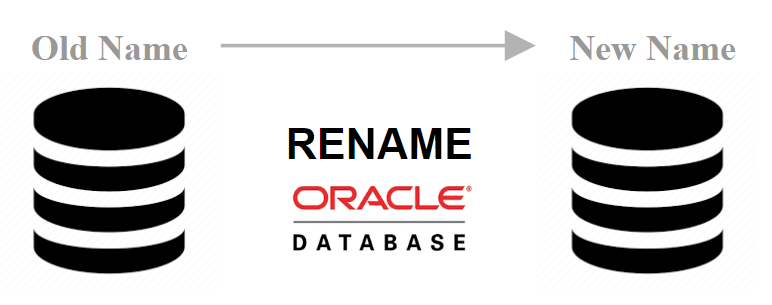
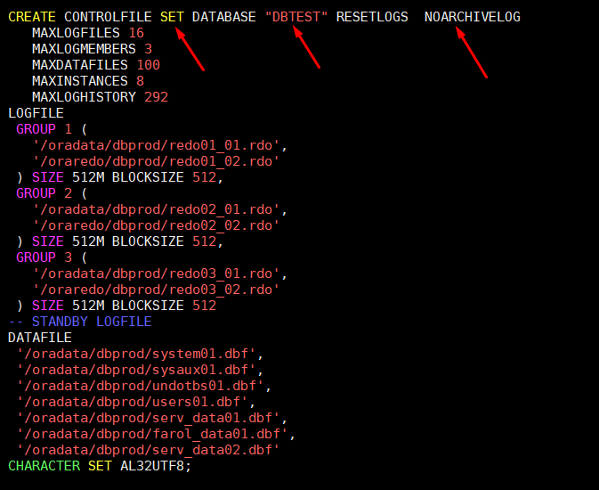
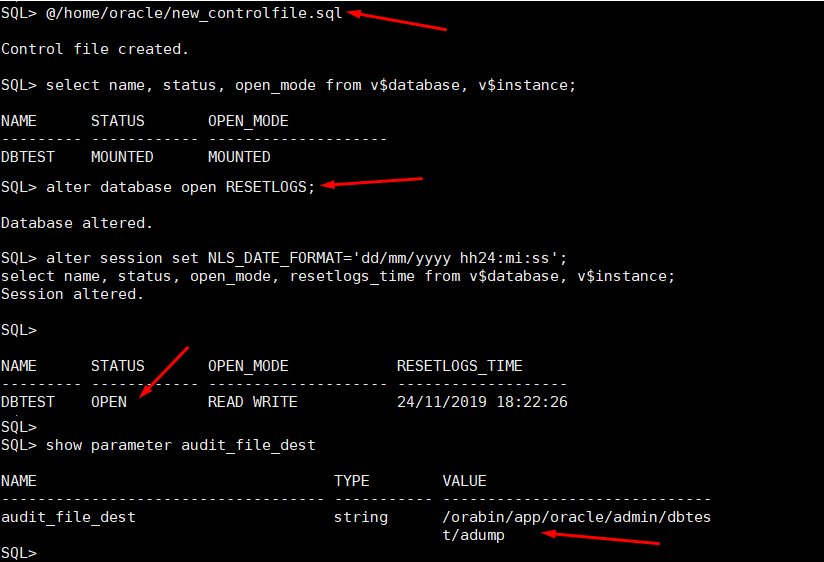

<!--  -->


# Alterando o nome do banco de dados Oracle (DBA)
##### Publicado em 24/11/2019 por [Michel Souza](https://www.linkedin.com/in/michel-ferreira-souza/)
##### Atualizado em 25/11/2019

Fala galera, neste post apresento como alterar o nome de um banco de dados Oracle. 
Faz um tempo que planejo escrever artigos na área em que atuo e vejo que esse é o momento. Então, hoje darei início ao meu primeiro artigo e o intuito é apresentar algo que aplico no dia a dia, e também com o conhecimento que venho adquirindo com o estudo para a tão sonhada certificação.
> *"A melhor forma de aprender é ensinando ou compartilhando conhecimento"*

Então, CHEGA de **blá blá blá** e vamos nessa Pequeno-Gafanhoto DBA. 
Estou assumindo que você tem um contato com administração de banco de dados Oracle, por isso não vou me aprofundar em alguns comandos.

## Cenário
Vamos supor que sua empresa decidiu mudar o banco de dados (DBPROD) para a nuvem, ou o seu sysadmin fez a cópia completa da VM (ambiente produtivo) e é necessário que o banco seja renomeado (DBTEST) para utilizarem como ambiente de teste. 

## Iniciando
Tem-se duas formas de alterar o nome de um banco de dados, 1) manual ou 2) com o utilitário nid (DBNEWID). Neste artigo irei abordar a forma manual.

> **Observação:** Antes de qualquer manutenção em um banco de dados, temos que verificar qual o nome do banco ```"instância"``` que se encontra conectado.  

Para verificar a instância atual, utilize a seguinte consulta.
```sql 
SQL> select name, status, open_mode from v$database, v$instance;
```


Nota-se que o banco atual é **DBPROD** com status aberto, modo archivelog e no modo leitura e escrita.

Depois de identificar a instância atual é necessário realizar o backup do controlfile utilizando o seguinte comando. 
```sql
SQL> alter database backup controlfile to trace;
Database altered.
```
É preciso localizar o arquivo de trace gerado no backup do controlfile, pode-se utilizar o comando abaixo.

```sql
SQL> col tracefile form a100;
select 
    tracefile
from v$session s,
v$process p
where s.paddr = p.addr
and s.audsid = sys_context('USERENV', 'SESSIONID');

TRACEFILE
--------------------------------------------------------
/orabin/app/oracle/diag/rdbms/dbprod/dbprod/trace/dbprod_ora_3937.trc

```
Com a localização do arquivo de trace, criado no comando do backup controlfile, extrai-se o conteúdo do arquivo de controle para a criação com o novo nome do banco. O comando seguinte extrai o arquivo de controle necessário e salva o conteúdo no arquivo **new_controlfile.sql**.
### Extraindo o controlfile do trace para ser recriado.
```sql
sed -n '/CREATE.* RESETLOGS/,$p' teste.txt | \
sed '/.*;/q' | \
sed 's/\(GROUP...\).*\( SIZE\)/\1\2/' | \
sed 's/DBPROD/DBTEST/g' | \
sed 's/REUSE/SET/g' | \
sed 's/^ARCHIVELOG/NOARCHIVELOG/g'  > new_controlfile.sql
```
Se atente para o comando */DBPROD/DBTEST/*, substitua pelos nomes que envolve a sua instância.

Percebe-se que o comando modificou o arquivo de controle de **REUSE** para **SET**, usado para setar com o novo nome ```DBTEST``` e como esse banco será utilizado para ambiente de teste, faz-se a alteração do modo **ARCHIVELOG** para **NOARCHIVELOG**, pois não se pretende recuperar o banco de dados em caso de falha. A imagem abaixo apresenta a saida do comando ```sed```.   

> **Observação:** Nota-se o uso do comando *[sed](https://linux.die.net/man/1/sed)* que é um editor de textos não iterativo para manipulação de arquivos e streams do Unix/Linux, permiti substituir e “casar” padrões, utilizando Expressões Regulares. 

Caso o banco de dados esteja em modo archivelog, conecte na instância e utilize o próximo comando para gerar alguns logs. 

```sql
SQL> ALTER SYSTEM SWITCH LOGFILE;
System altered.
```

Se faz necessário a criação de um pfile a partir do spfile, utilize o comando abaixo para criar um pfile no diretório /tmp. Caso não esteja familiarizado com os arquivos de parâmetro para a inicialização da instância no Oracle, consulte [aqui](http://www.dba-oracle.com/concepts/pfile_spfile.htm).
```sql
SQL> create pfile='/tmp/pfileProd.ora' from spfile;
File created.

```
Para realizar a alteração do nome do banco de dados é necessário  encerrar *"shutdown"* o banco alvo. 
```sql
SQL> shut immediate;
Database closed.
Database dismounted.
ORACLE instance shut down.
```
### Atualizando o arquivo **ORATAB**
O arquivo ORATAB é utilizado pelo script ORAENV para definir automaticamente as variáveis de ambiente ORACLE_SID, ORACLE_HOME e PATH, entenda mais clicando [aqui](http://www.dba-oracle.com/t_linux_oracle_oraenv.htm). 
Para atualizar o arquivo oratab, utilize o comando abaixo. 
> **Observação:** Nota-se o uso da variável ORACLE_HOME, valor que já está setado para a instância dbprod. Caso queira pode substituir o **${ORACLE_HOME}** com o resultado do comando ```echo $ORACLE_HOME```, ou edite o arquivo */etc/oratab* manualmente.
```bash
cat >> /etc/oratab <<EOF
dbtest:${ORACLE_HOME}:Y
EOF
```
O resultado do comando acima atualiza o arquivo ```/etc/oratab```, conforme imagem abaixo.


### Atualizando os parâmetros do pfile e criando novos diretórios. 
Aqui vamos seguir algumas etapas que necessita de atenção.
1. Atualize o arquivo pfile criado em **/tmp/pfileProd.ora**. 
    * aqui costumo atualizar o arquivo pfile com o comando abaixo, vou substituir "dbprod" para "dbtest" e criar um arquivo **newPfile.ora**.
```bash
sed 's/dbprod/dbtest/g' /tmp/pfileProd.ora > newPfile.ora
```

2. Remover os controlfiles existentes no local na saída do comando abaixo.
```bash
grep control_files /tmp/pfileProd.ora

-- saída
*.control_files='/oradata/dbprod/control01.ctl','/orabin/app/oracle/fast_recovery_area/dbprod/control02.ctl'#Restore Controlfile
```

```bash
rm /oradata/dbprod/control01.ctl
rm /orabin/app/oracle/fast_recovery_area/dbprod/control02.ctl
```

3. Criando novo diretório do controlfile e dos parâmetros do pfile.
```bash
grep 'audit_file_dest\|control_files\|log_archive_dest_*' newPfile.ora

-- saída
*.audit_file_dest='/orabin/app/oracle/admin/dbtest/adump'
*.control_files='/oradata/dbtest/control01.ctl','/orabin/app/oracle/fast_recovery_area/dbtest/control02.ctl'#Restore Controlfile
*.log_archive_dest_1='location=/oraarchive/dbtest/'
```
> **Observação:** Crie todos os diretórios existentes no comando acima. Caso contrário, ao tentar iniciar a instância com o pfile, irá obter o erro abaixo. 


```bash
mkdir -p /orabin/app/oracle/admin/dbtest/adump
mkdir -p /oradata/dbtest
mkdir -p /orabin/app/oracle/fast_recovery_area/dbtest
mkdir -p /oraarchive/dbtest/
```
### Recriando novo controlfile
Com o novo SID registrado no /etc/oratab, utilize o oraenv para setar as variáveis ORACLE_SID e ORACLE_HOME, utilize o comando a seguir.
```sql
. oraenv <<< dbtest
```

Agora abra o banco de dados no estágio nomount usando pfile ```newPfile.ora```.

```sql
SQL> startup nomount pfile=/home/oracle/newPfile.ora;
```
Recrie o arquivo de controle usando os comandos abaixo ou o arquivo **new_controlfile.sql** que criamos anteriormente.

```vim
CREATE CONTROLFILE SET DATABASE "DBTEST" RESETLOGS  NOARCHIVELOG
    MAXLOGFILES 16
    MAXLOGMEMBERS 3
    MAXDATAFILES 100
    MAXINSTANCES 8
    MAXLOGHISTORY 292
LOGFILE
  GROUP 1 (
    '/oradata/dbprod/redo01_01.rdo',
    '/oraredo/dbprod/redo01_02.rdo'
  ) SIZE 512M BLOCKSIZE 512,
  GROUP 2 (
    '/oradata/dbprod/redo02_01.rdo',
    '/oraredo/dbprod/redo02_02.rdo'
  ) SIZE 512M BLOCKSIZE 512,
  GROUP 3 (
    '/oradata/dbprod/redo03_01.rdo',
    '/oraredo/dbprod/redo03_02.rdo'
  ) SIZE 512M BLOCKSIZE 512
-- STANDBY LOGFILE
DATAFILE
  '/oradata/dbprod/system01.dbf',
  '/oradata/dbprod/sysaux01.dbf',
  '/oradata/dbprod/undotbs01.dbf',
  '/oradata/dbprod/users01.dbf',
  '/oradata/dbprod/serv_data01.dbf',
  '/oradata/dbprod/farol_data01.dbf',
  '/oradata/dbprod/serv_data02.dbf'
CHARACTER SET AL32UTF8;
```

Recriando o controlfile
```sql
SQL> @/home/oracle/new_controlfile.sql
```
Abrindo o banco com RESETLOGS.
```sql
SQL>  alter database open RESETLOGS;
```

### Resultado final
Conforme na imagem abaixo, nota-se que o arquivo de controlfile foi criado com sucesso e o banco aberto no modo read-write.


>**Nota**: realizado a alteração do nome do banco de dados é necessario recriar o arquivo de senha *passwordfile*, atualizar os arquivos *tnsname.ora* e *listener.ora* com o nome do novo db_name.

##### [Adicionado] - 25/11/2019
Como mencionado no inicio do artigo, outra forma de alterar o nome do banco de dados é utilizando o utilitario DBNEWID.
> A vantagem do uso do utilitario DBNEWID é a facilidade e segurança no processo de alteração do DB_NAME e DBID, proporcionando também o gerenciamento de backup de um novo DBID no catálogo do RMAN, [Franky Faust](https://www.linkedin.com/in/frankyweber/).

E isso é tudo, espero que esse passo a passo ajude em algum momento. 

Até o próximo artigo e vamos em frente!!!

#FocoForçaFé

<a href="https://www.linkedin.com/in/michel-ferreira-souza/" target="_blank">Michel Souza</a><br>

### Referências
<a href="http://www.dba-oracle.com/t_linux_oracle_oraenv.htm" target="blank">Linux oraenv Tips</a><br>
<a href="http://www.dba-oracle.com/t_linux_oracle_oraenv.htm" target="blank">Linux oraenv Tips</a><br>
<a href="http://www.dba-oracle.com/concepts/pfile_spfile.htm" target="blank">create spfile from pfile tips</a><br>
<a href="http://www.dba-oracle.com/t_rename_database_oracle_sid.htm" target="_blank">How to rename an Oracle database ORACLE_SID?</a><br>
<a href="https://linux.die.net/man/1/sed" target="_blank">Command sed</a><br>
<a href="https://docs.oracle.com/cd/E11882_01/server.112/e22490/dbnewid.htm#SUTIL014" target="_blank">DBNEWID Utility</a><br>

<!-- [Linux oraenv Tips](http://www.dba-oracle.com/t_linux_oracle_oraenv.htm) <br>
[create spfile from pfile tips](http://www.dba-oracle.com/concepts/pfile_spfile.htm) <br>
[How to rename an Oracle database ORACLE_SID?](http://www.dba-oracle.com/t_rename_database_oracle_sid.htm) <br>
[Command sed](https://linux.die.net/man/1/sed) <br>
[DBNEWID Utility](https://docs.oracle.com/cd/E11882_01/server.112/e22490/dbnewid.htm#SUTIL014) -->